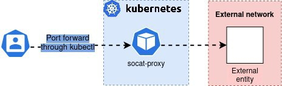

# Kubernetes-socatpod

Simple Yaml that creates a Kubernetes pod.
The pod is based on alpine that runs the tool [socat](https://linux.die.net/man/1/socat).

## Configuration:
Socat is configured to accept `TCP` or `UDP` traffic on an incoming port that is exposed on the pod
It then forwards the traffic towards an endpoint of choice.

## Result:
You can port-forward to the resulting pod using `kubectl`. The pod itself acts as a hop for your local machine. 
This means you can access services inside the cluster that would normally not be available due to networking/firewalls.

It can also be used to access an external entity that is only available to k8s resources such as deployments/daemonsets.

## visual representation:

